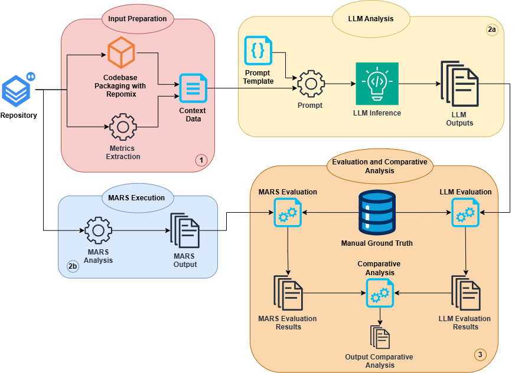

# 🧩 Rilevazione di Anti-Pattern in Architetture a Microservizi tramite LLM: confronto con Tecniche di Analisi Statica


> **Tesi di Laurea Magistrale in Ingegneria Informatica**  
> Università degli studi di Napoli Federico II
>                 
> Anno Accademico 2025/2026

**Candidato:** Antimo Barbato (matr. M63001079)  
**Relatore:** Ch.ma Prof.ssa Anna Rita Fasolino  
**Correlatore:** Ing. Marco De Luca

---

## 📌 Panoramica

Questo repository contiene il materiale relativo alla tesi magistrale incentrata sull'utilizzo di **Large Language Models (LLM)** per la rilevazione automatica di **anti-pattern architetturali** in sistemi a microservizi, con un confronto sistematico rispetto allo strumento di analisi statica **MARS** (*Microservice Antipatterns Research Software*).

Il lavoro è stato condotto su un corpus di **13 repository Java open-source** e ha valutato le capacità di tre LLM — **ChatGPT 5.2**, **Gemini 3.0 Pro** e **Qwen Plus 3.5** — nel riconoscere **16 anti-pattern** selezionati da un catalogo di 58 proposto in letteratura da Cerny e Taibi. La procedura ha previsto **624 inferenze indipendenti**.

> 📄 Un paper derivato da questa tesi è stato accettato alla **ICSME 2025** *(International Conference on Software Maintenance and Evolution)*.

---

## 🗂️ Struttura del Repository

```
📦 root
├── 📁 File_Input/              # Repository analizzate (input del processo di valutazione)
├── 📁 Output_LLM/              # Output grezzi e strutturati dei tre LLM
├── 📁 output_mars/             # Output dello strumento MARS per i progetti analizzati
├── 📁 Tesi_LaTeX/              # Sorgente LaTeX completo della tesi
├── 📄 prompts_antipattern.md   # Prompt utilizzati per l'interrogazione degli LLM
├── 📄 repomix.config.json      # Configurazione Repomix per il packaging dei repo
├── 📄 extract_build_info.py    # Script per l'estrazione di metadati di build (usato in fase preliminare)
└── 📄 loc2.py                  # Script per il conteggio delle linee di codice (LOC)
```

---

## 🎯 Research Questions

| ID | Domanda di Ricerca |
|----|--------------------|
| **RQ1** | Quanto sono efficaci gli LLM nel rilevare gli anti-pattern nelle MSA? |
| **RQ2** | Come si confrontano gli LLM con gli strumenti di analisi statica allo stato dell'arte per il rilevamento degli anti-pattern nelle MSA? |

---

## 🧪 Metodologia

### Dataset
13 repository open-source a microservizi, eterogenee per dimensione (da sistemi dimostrativi con poche centinaia di LOC fino a sistemi enterprise con quasi 90.000 LOC):

| Repository | Microservizi | File | LOC |
|---|---|---|---|
| Apollo | 9 | 68 | 29.510 |
| TeaStore | 3 | 62 | 5.073 |
| Spring Cloud Microservice Movie | 4 | 33 | 885 |
| Freddy's BBQ | 6 | 35 | 1.752 |
| Piggymetrics | 4 | 88 | 3.176 |
| FTGO | 9 | 257 | 8.239 |
| Spring Boot Microservices | 2 | 4 | 116 |
| Lakeside Mutual | 9 | 424 | 89.477 |
| Warehouse Microservice | 6 | 222 | 4.623 |
| Qbike | 5 | 77 | 2.057 |
| Microservice Demo | 3 | 38 | 1.766 |
| CQRS Microservice Sampler | 3 | 26 | 1.028 |
| Micro Company | 17 | 244 | 90.315 |

La **ground truth** è stata costruita manualmente dagli autori dello studio MARS attraverso un processo di validazione umana (non generata automaticamente dal tool).

### LLM Utilizzati

| Modello | Sviluppatore | Context Window |
|---------|-------------|----------------|
| ChatGPT 5.2 | OpenAI | 400.000 token |
| Gemini 3.0 Pro | Google DeepMind | 1.000.000 token |
| Qwen Plus 3.5 | Alibaba Cloud | 1.000.000 token |

### Pipeline Sperimentale

La procedura si articola in quattro fasi:

1. **Fase 1 – Input Preparation**: ogni repository viene aggregata con **Repomix** in un unico artefatto testuale LLM-friendly; parallelamente uno script Python estrae metriche quantitative (LOC, numero di file e servizi).
2. **Fase 2a – LLM Analysis**: i Context Data vengono combinati al Prompt Template per ciascun anti-pattern e sottoposti ai tre modelli. Ogni inferenza è eseguita in una sessione isolata e stateless (senza memoria pregressa) per garantire indipendenza tra i test.
3. **Fase 2b – MARS Execution**: parallelamente, viene eseguito MARS per ottenere la baseline di confronto.
4. **Fase 3 – Evaluation**: gli output degli LLM e di MARS vengono confrontati con la ground truth manuale tramite **Precision**, **Recall** e **F1-score**.

In totale: **16 anti-pattern × 13 repository × 3 LLM = 624 inferenze indipendenti**.

<p align="center">
  
  <br><em>Figura: Pipeline sperimentale adottata nello studio</em>
</p>

---

## 🔬 Anti-Pattern Analizzati

I 16 anti-pattern selezionati (rilevabili da MARS) coprono cinque macro-categorie del catalogo di Cerny e Taibi (58 AP totali):

**Intra-service design** — difetti nella progettazione interna del singolo servizio
- Nano-Service, Mega-Service, No API Versioning

**Inter-service decomposition** — errori nella decomposizione e nelle relazioni tra servizi
- Cyclic Dependency, Shared Libraries, Shared Persistency, Wrong Cuts

**Service interaction** — problemi nei meccanismi di comunicazione tra servizi
- Hardcoded Endpoint, No API Gateway, Timeout, No Health Check

**Team organization** — difetti nelle pratiche operative e DevOps
- No CI/CD, Multiple Service Instances Per Host (MSIPH), Insufficient Monitoring, Local Logging, Manual Configuration

> La distinzione tra anti-pattern **visibili dalla codebase** (es. Hardcoded Endpoint, No API Gateway, No CI/CD) e anti-pattern che richiedono una **ricostruzione relazionale o contestuale** (es. Cyclic Dependency, Shared Libraries, Mega-Service, Nano-Service) è il principale framework esplicativo adottato per interpretare la varianza nelle prestazioni degli LLM.

---

## 📊 Principali Risultati

### Profilo dei modelli (RQ1)

| LLM | Profilo |
|-----|---------|
| **ChatGPT 5.2** | Più bilanciato — miglior compromesso tra Precision e Recall |
| **Qwen Plus 3.5** | Conservativo — alta Precision, basso Recall (pochi falsi positivi) |
| **Gemini 3.0 Pro** | Aggressivo — alto Recall, bassa Precision (molti falsi positivi) |

### Anti-pattern ben rilevati dagli LLM
Hardcoded Endpoint, No API Versioning, No CI/CD, No API Gateway — casi in cui l'anti-pattern lascia tracce esplicite nella repository.

### Anti-pattern difficili per gli LLM
Cyclic Dependency, Shared Libraries, Mega-Service, Nano-Service — casi che richiedono ricostruzione relazionale esplicita, validazione architetturale profonda o combinazione di segnali quantitativi e qualitativi.

### Confronto con MARS (RQ2)
LLM e MARS risultano **complementari**: gli LLM sono più efficaci nei casi che richiedono flessibilità interpretativa e generalizzazione; MARS prevale quando il difetto può essere ricondotto a regole deterministiche su dipendenze, configurazioni o soglie numeriche. La direzione più promettente è un **approccio ibrido** che combini la robustezza dell'analisi statica con la flessibilità interpretativa dei modelli linguistici.

---

## 🛠️ Come Riprodurre l'Analisi

### Prerequisiti
```bash
npm install -g repomix   # Installazione Repomix
python >= 3.9            # Per gli script di supporto
```

### Step 1 — Packaging del repository
```bash
repomix --config repomix.config.json /path/to/microservice-repo
```

### Step 2 — Estrazione metriche
```bash
python loc2.py
```

### Step 3 — Interrogazione degli LLM
Fornire l'output di Repomix come contesto all'LLM, utilizzando i prompt per ciascun anti-pattern presenti in `prompts_antipattern.md`. Ogni inferenza deve essere eseguita in una sessione isolata (nuova chat, senza memoria pregressa).

---

## 📚 Riferimenti Chiave

- **Cerny & Taibi** — catalogo di 58 anti-pattern nelle architetture a microservizi (fonte del catalogo e della ground truth)
- **MARS** (*Microservice Antipatterns Research Software*) — strumento di analisi statica rule-based basato su metamodello, utilizzato come baseline
- **Repomix** — tool per il packaging di repository in formato LLM-friendly
- Il paper derivato da questa tesi è stato accettato agli atti di **ICSME 2025**

---

<p align="center">
  <i>Questo lavoro è a scopo accademico. I repository analizzati sono open-source e i rispettivi diritti appartengono ai loro autori.</i>
</p>
